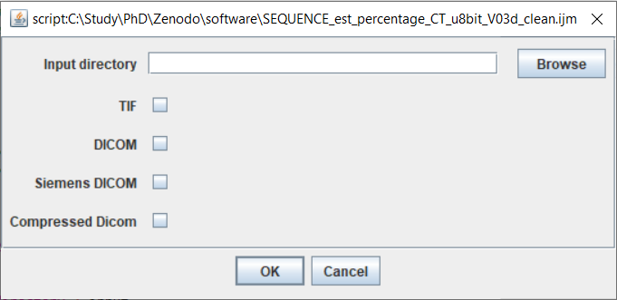

[](https://doi.org/10.12688/f1000research.109020.1) [](https://doi.org/10.5281/zenodo.7885379)

# ImageJ Pneumonia Estimation Tool

Schätz M, Rubešová O, Mareš J et al. Estimation of Covid-19 lungs damage based on computer tomography images analysis [version 1; peer review: awaiting peer review]. F1000Research 2022, 11:326 (https://doi.org/10.12688/f1000research.109020.1)

Zenodo: CT scans of COVID-19 patients [](https://doi.org/10.5281/zenodo.5805939)

The Covid CT estimation tool is a Fiji script for semi-automatic analysis of percentage of the Covid damage in the lungs based on the computer tomography (CT) files. 
FIJI is widely used BioImage Analysis tool - a prepared ImageJ with BioImage plugin (needed for importing various imaging formats), could be found on https://imagej.net/Fiji. The package contains examples of different biological and biomedical data and perfectly suitable for processing of medical images.

The tool is developed in cooperation with the radiology department of hospital "Fakultni Nemocnice Kralovske Vinohrady".  
The Covid CT estimation tool is based on the standard image processing techniques. Our interest is in volume, so same voxel size is critical for good enough estimation. But it is also important to go through different types of data we can encouter. In general, the Hounsfield Units (HU) make up the grayscale in medical CT imaging. It is a scale from black to white of 4096 values (12 bit) and ranges from -1024 HU to 3071 HU (zero is also a value). It is defined by the following:

-1024 HU is black and represents air (in the lungs). 0 HU represents water (since we consist mostly out of water, there is a large peak here). 3071 HU is white and represents the densest tissue in a human body, tooth enamel. All other tissues are somewhere within this scale; fat is around -100 HU, muscle around 100 HU and bone spans from 200 HU (trabecular/spongeous bone) to about 2000 HU (cortical bone).

DICOM files are usally saved in signed 16 bit, with original HU. TIFF however has reshaped histogram values to cover whole range, and can be in unsigned 8bit or 16bit. TIFF values usualy loose Z voxel size metadata in conversion (resulting to Z voxel size value of 1), so it is important to reset voxel values. The voxel size can be different with each data set, even from same CT machine. The distribution of intensity values may change with different CT protocol, so some of the processing steps needs to be done manualy. The workflow follows the Croney Ethical guidelines for the appropriate use and manipulation of scientific digital images.

## The workflow
1) Importing data
2) Noise supression using median filter
3) Bit depth conversion (so we have same bit depth for all processing)
4) Duplication of data for lung and desiese segmentation
5) Manual tresholding of air/background
6) Cleaning of resulting mask, so only inside of body is kept (e.g. lungs), with morhpological deletion of too small round parts.
7) Manual tresholding of desiese (with posibility to select all values)
8) Mask cleaning with erosion and dilatation to clear mask pixels stuck on sides of lungs.
9) Logical AND  between lung mask and desies mask, to get only disease pixel inside lungs.
10) Volume sumation over lung mask
11) Volume sumation over disease mask
12) Creating raw % value between disease and lungs
13) Substraction of 3%, which corresponds to % median of lung tissue from healthy patiens (estimated from 10 CTs).
14) Score estimation based on (0:0%; 1, < 5%; 2:5–25%; 3:26–50%; 4:51–75%; 5, > 75%; range 0–5).
15) Log with all user input, results and file location is saved, together with the masks and combination of both masks with CT data. All information necessary to do exactly same data processing using this tool is saved.

## Limitations
The biggest limitation of this approach is human error and inter and intra variation of manual selection. The percentage estimation might also be affected by other body cavities filled with air. There might also be a variance in results based on slice thickness, in worst case scenario 20%, but our experiment shows that there is only about 0.58% difference in result between 0.6 and 3mm CT slice thickness. The scoring should also be improved so it is not dependent only on one value (volume percentage), but normalized SHU distribution in the pneumonia area should also be considered. When converting from 12-bit to 8-bit image representation, the reduced range of values results in a loss of information and detail, which can lower the quality of the output. However, for CT image segmentation, the use of Single Hounsfield Unit (SHU) values is adequate, as SHUs do not rely on single units and can provide good-quality segmentation. From the software point of view, there is a limitation in the version of ImageJ used. The new version of the code logs the ImageJ version and BioImage plugin version. There is a version of the code explicitly made for ImageJ version 1.52v99 and for other versions. The bind version helps reproducibility of any analysis based on logs, and it is advised to reproduce the analysis in the same version of ImageJ as indicated in logs

## The tool runtime which require user inputs
<ol>
<li>Select the CT lung data (TIFF or DICOM file based on the script version) - the CT sequence is opened and could be go through as a image sequence with slider or as a video with play button. 

<p align="center">
     
   <br>Img 1: 8 bit tool version menu</br>
</p>
<p align="center">
     
   <br>Img 2: 16 bit tool version menu</br>
</p>
</li>
<li>"Please select Window/Level" - the correct Window/Level should be configured and applied for efficient covid estimation
<p align="center">
     
   <br>Img 3: Window/Level cofiguration</br>
</p>
</li>
<li>"Please find the start of lungs in stack" - the first image with lungs should be found with the slider and confirm with the "Ok" button.
<p align="center">
     
   <br>Img 4: Select start of lung dialog</br>
</p>
</li>
<li>"Please find the end of lungs in stack" - the last image with lungs should be found with the slider and confirm with the "Ok" button. The tool works with the images only in between the chosen interval of the lungs stack to minimize the computational effort.
<p align="center">
     
   <br>Img 5: Select end of lung dialog</br>
</p>
</li>
<li>"Setup threshold for all but body" - the whole image- exclude the body, shall be highlighted with red colour. The tool makes automatic estimation, and the user can adjust the threshold with the sliders on the histogram. Confirm with the "Ok" button.
<p align="center">
     
   <br>Img 6: Setup threshold of environment and lungs dialog</br>
</p>
</li> 
<li>"Setup threshold of Covid" - the covid threshold shall be highlighted with red colour. The tool makes automatic estimation, and the user can adjust the threshold with the sliders on the histogram. It is not a problem if part of the body (not lungs!) will be chosen together with Covid. The tool automatically subtracts the body threshold from the chosen Covid threshold. Confirm with the "Ok" button.
<p align="center">
     
   <br>Img 7: Setup threshold of Covid dialog</br>
</p>
</li> 
</ol>
## Results
After each calculation the tool is adding information to the log window. The log file is automatically saved to the CT data directory. The output lungs and covid masks are saved in TIFF format into additional folder in the CT data location.  

The tool provides % estimation of a Covid damage in the lungs and a semi-quantitative CT score. The score is calculated based on the extent of lobar involvement (0:0%; 1, < 5%; 2:5–25%; 3:26–50%; 4:51–75%; 5, > 75%; range 0–5 based on the medical research "Chest CT score in COVID-19 patients: correlation with disease severity
and short-term prognosis"*. 

The tool has shown been tested both 3 mm slicing and 0.6 mm slicing CT images. The results were similar in percentage and the final CT score was the same. 

## Tool versions
There are 2 versions of the tool available: 
1. The script to work with 16 bits files - SEQUENCE_est_percentage_CT_16bit_V03clean.ijm
2. The script to work with 8 bits file - SEQUENCE_est_percentage_CT_u8bit_V03d_clean.ijm

*"Chest CT score in COVID-19 patients: correlation with disease severity
and short-term prognosis"
Marco Francone1 & Franco Iafrate1 & Giorgio Maria Masci1 & Simona Coco1 & Francesco Cilia1 & Lucia Manganaro1 &
Valeria Panebianco1 & Chiara Andreoli2 & Maria Chiara Colaiacomo2 & Maria Antonella Zingaropoli3 &
Maria Rosa Ciardi3 & Claudio Maria Mastroianni3 & Francesco Pugliese4 & Francesco Alessandri4 & Ombretta Turriziani5 &
Paolo Ricci1,2 & Carlo Catalano1
Received: 7 April 2020 /Revised: 5 June 2020 /Accepted: 12 June 2020

## If you are using this software tool, please cite:

Schätz M, Rubešová O, Mareš J *et al*. Estimation of Covid-19 lungs damage based on computer tomography images analysis [version 1; peer review: awaiting peer review]. F1000Research 2022, **11**:326 (https://doi.org/10.12688/f1000research.109020.1)

```
@article{Schatz2022,
  doi = {10.12688/f1000research.109020.1},
  url = {https://doi.org/10.12688/f1000research.109020.1},
  year = {2022},
  month = mar,
  publisher = {F1000 Research Ltd},
  volume = {11},
  pages = {326},
  author = {Martin Sch\"{a}tz and Olga Rube{\v{s}}ov{\'{a}} and Jan Mare{\v{s}} and David Girsa and Alan Spark},
  title = {Estimation of Covid-19 lungs damage based on computer tomography images analysis},
  journal = {F1000Research}
}
```

# European Society of Radiology 2020
European Radiology
https://doi.org/10.1007/s00330-020-07033-y
