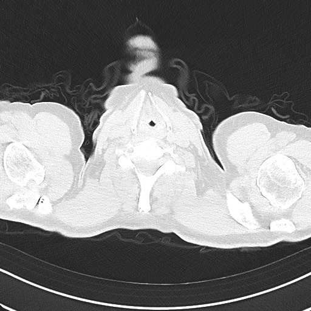
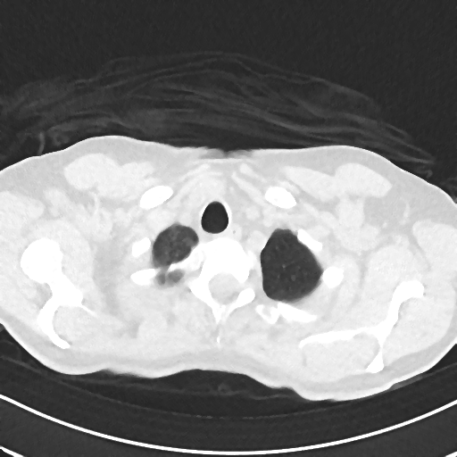
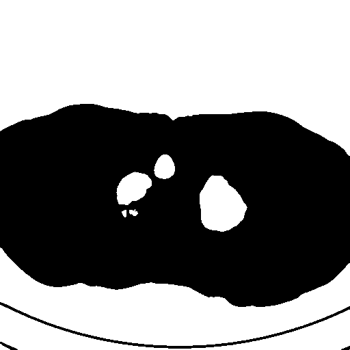
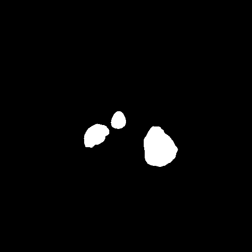
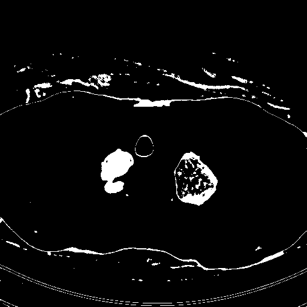
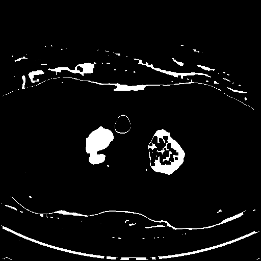
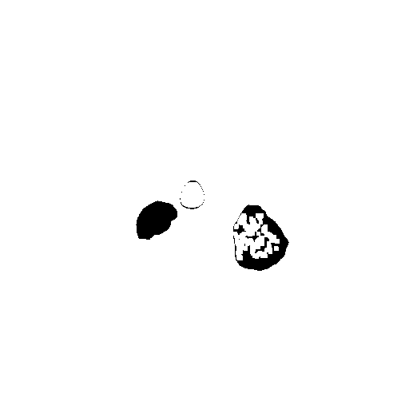
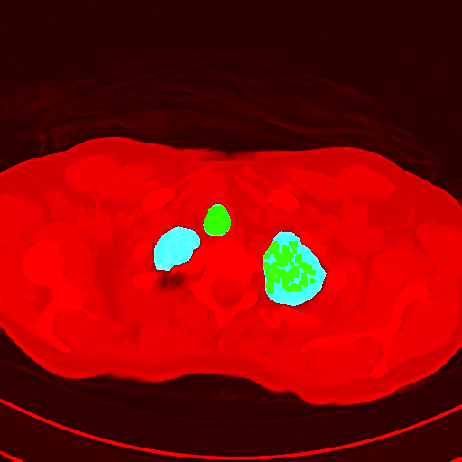

```java
//	V 0.1
ver = "p0.1"
//  update: 04.11.2022
//	by: Martin Schätz
//  email: schatzm@vscht.cz
//
// based on V 0.3clean 27.12.2021 Clean version
/////////////////////////////////////////////////////////////////
/////////////////////////////////////////////////////////////////

```

 * # General info

```java

print("\\Clear");
run("Close All");
print("Version: " + ver + ", last edit 04.11.2022");

//Open files
////////////////////////////


//#@ File (label = "Output directory", style = "directory") output


if ((bTiff & bDICOM) | (bDICOM & bCDICOM) | (bCDICOM & bTiff)) {
	print("\\Clear");
	exit("Only one file type can be selected");
}


openSequenceFolder(input,bCDICOM,bDICOM,bTiff,bSDICOM);

if (bTiff | bDICOM) {
	print("uint16 used");
	


}

if (lung){
	width=1070; level=-340;
	min = level - width/2;
    max = level + width/2;
    setMinAndMax(min, max);
    print("Lung view, width: " + width + ", level: "+ level);
} 
if (bone){
	width=500; level=200;
	min = level - width/2;
    max = level + width/2;
    setMinAndMax(min, max);
    print("Bone view, width: " + width + ", level: "+ level);
}

```
<pre>
> Version: p0.1, last edit 04.11.2022
> Opening: C:\01_projects\01_COVID_sw_tool\DATA\CT1_2\CT1_2_TIFF\CT1_2_TIFF0000.tif
> uint16 used
</pre>
<a href="image_1667574287995.png"></a>

 * # Processing

```java


// get image name
title=getTitle();
//////////////////////////


start=getTime();
if (!MMp) {
	setBatchMode("show");
}

imgDir = input;
getDateAndTime(year, month, dayOfWeek, dayOfMonth, hour, minute, second, msec);
acTime="";
acTime = "" + year + "_" + month + "_" + dayOfMonth + "_" + hour + "_" + minute + "";
print(acTime);

dirArray=split(imgDir, File.separator());
dirName=dirArray[dirArray.length-1];

getDimensions(width, height, channels, slices, frames);

```
<pre>
> 2022_10_4_16_4
</pre>

 * ## Lung masking

```java

//print("Image path: "+replace(fileDir,title,""));
//select lung parts
waitForUser("Lung selection", "Please find start of lungs in stack");
start=getSliceNumber();
waitForUser("Lung selection", "Please find end of lungs in stack");
end=getSliceNumber();
if (!MMp) {
	setBatchMode(true);
}
print("Start of lungs: "+start);
print("End of lungs: "+end);
run("Duplicate...", "duplicate range="+start+"-"+end);
rename("orig");
selectImage(title);
close(title);
selectImage("orig");

// get voxel size
getVoxelSize(Vwidth, Vheight, Vdepth, Vunit);

// get iamge location
maskDir = imgDir+"masks_"+acTime+File.separator;
if (!File.exists(maskDir))
	File.makeDirectory(maskDir);
	
print("Image directory: "+imgDir);
saveAs("tiff",maskDir+replace(title,".tiff","")+"_lungs_subpart");
rename("orig");

if (lung){
	width=1070; level=-340;
	min = level - width/2;
    max = level + width/2;
    setMinAndMax(min, max);
    run("Apply LUT", "stack");
} 
if (bone){
	width=500; level=200;
	min = level - width/2;
    max = level + width/2;
    setMinAndMax(min, max);
    run("Apply LUT", "stack");
}

// apply median filter
run("Median...", "radius=2 stack");
selectImage("orig");

// enhance contrast for better details
//run("Enhance Contrast", "saturated=0.35");
//run("Apply LUT", "stack");

// duplicate stack for lung thresholding
run("Duplicate...", "duplicate");
rename("lungs");

// duplicate stack for covid thresholding
run("Duplicate...", "duplicate");
rename("covid");

//processing
/////////////////////////////////////////////////
//setBatchMode(false);
selectImage("lungs");
run("Original Scale");

// set same voxel size
setVoxelSize(Vwidth, Vheight, Vdepth, Vunit);

//run("8-bit");
run("Threshold...");
		setAutoThreshold("Default dark");
        getThreshold(lower,upper);
        setThreshold(-1024, lower);
if (!MMp) {
	setBatchMode("show");
}

waitForUser("Setup threshold for all but body");
if (!MMp) {
	setBatchMode("hide");
}

getThreshold(lowerLungs,upperLungs);

```
<pre>
> Start of lungs: 17
> End of lungs: 91
> Image directory: C:\01_projects\01_COVID_sw_tool\DATA\CT1_2\CT1_2_TIFF
</pre>
<a href="image_1667574301049.png"></a>
<a href="image_1667574301508.png"></a>
<a href="image_1667574301910.png"></a>

 * ### Making lung mask

```java

run("Convert to Mask", "method=Default background=Light black");

//run("Invert", "stack"); //invert
run("Analyze Particles...", "size=800-Infinity pixel circularity=0.12-1.00 show=Masks exclude clear add stack");
run("Invert LUT");
//run("Invert", "stack"); //invert

run("Dilate", "stack");
run("Dilate", "stack");
run("Fill Holes", "stack");
run("Erode", "stack");
run("Erode", "stack");
//run("Invert", "stack");
run("Convert to Mask", "method=Default background=Light black");

// save mask
saveAs("tiff",maskDir+replace(title,".tiff","")+"_lung_mask");
rename("mask_lungs");
/////////////////////////
```
<a href="image_1667574303308.png"></a>
<a href="image_1667574303373.png"></a>

 * ## Pneumonia/Covid masking

```java
 
selectImage("covid");
run("Original Scale");

// set same voxel size
setVoxelSize(Vwidth, Vheight, Vdepth, Vunit);
//run("8-bit");
run("Threshold...");
		setAutoThreshold("Default dark");
        getThreshold(lower,upper);
        

//setThreshold(38, 126);
if (!MMp) {
	setBatchMode("show");
}
waitForUser("Setup threshold for Covid");
if (!MMp) {
	setBatchMode("hide");
}
getThreshold(lowerCov,upperCov);
run("Convert to Mask", "method=Default background=Light black");
if (!MMp) {
	setBatchMode(true);
}
run("Analyze Particles...", "size=0-Infinity pixel circularity=0.00-1.00 show=Masks exclude clear add stack");
run("Invert", "stack");

// get rid of small parts //needs to be optimised
run("Dilate", "stack");
run("Dilate", "stack");
run("Erode", "stack");
run("Erode", "stack");

//run("Invert", "stack");
run("Invert", "stack");
run("Invert LUT");

// save mask
saveAs("tiff",maskDir+replace(title,".tiff","")+"_covid_mask");
rename("mask_covid");
//////////////////////////////////

```
<a href="image_1667574318608.png"></a>
<a href="image_1667574318709.png"></a>

 * ## Combining Pneumonia/Covid mask and Lung mask

```java

//get only information inside of lungs
selectImage("mask_lungs");
run("Original Scale");
selectImage("mask_covid");
setVoxelSize(Vwidth, Vheight, Vdepth, Vunit);
imageCalculator("Multiply create stack", "mask_covid","mask_lungs");
rename("mask_covid_final");
run("Invert LUT");
//////////////////////////////////
```
<a href="image_1667574319674.png"></a>
<a href="image_1667574319748.png"></a>

 * Get Covid area

```java
//get covid area
selectImage("mask_covid_final");
//run("Analyze Particles...", "pixel display exclude clear add stack");
run("Analyze Particles...", "pixel exclude clear add stack");

CareaSum=0;
CIntInt=0;
for (i = 0; i < nResults; i++) {
	if (getResult("Area", i)>-1) {
		CareaSum=CareaSum+getResult("Area", i);
		CIntInt=CIntInt+getResult("RawIntDen", i);
	}
}
print("Covid area: " + CareaSum);

//////////////////////////////////
```
<pre>
> Covid area: 2546242
</pre>
<a href="image_1667574320284.png"></a>

 * Get lungs area

```java
//get lungs area
selectImage("mask_lungs");
//run("Analyze Particles...", "pixel display exclude clear add stack");
run("Analyze Particles...", "pixel exclude clear add stack");
LareaSum=0;
LIntInt=0;
for (i = 0; i < nResults; i++) {
	if (getResult("Area", i)>-1) {
		LareaSum=LareaSum+getResult("Area", i);
		LIntInt=LIntInt+getResult("RawIntDen", i);
	}
}
print("Lungs area: " + LareaSum);

selectImage("orig");
// if original data were 16 bit, we need to convert to 8-bit
run("8-bit");
run("Clear Results");

```
<pre>
> Lungs area: 2908376
</pre>
<a href="image_1667574320717.png"></a>
<a href="image_1667574321123.png"></a>

 * # Visualization

```java

//make visualization
run("Merge Channels...", "c1=orig c2=mask_lungs c3=mask_covid_final create");
saveAs("tiff",maskDir+replace(title,".tiff","")+"_composite_results.tiff");

close("\\Others");
if (!MMp) {
	setBatchMode("exit and display");
}
/////////////////////////////////

```
<a href="image_1667574321866.png"></a>

 * # Results

```java

print("Results: ");
print((CareaSum/LareaSum)*100);
print("Lung th:"+lowerLungs+", "+upperLungs);
print("Covid th:"+lowerCov+", "+upperCov);
percentage=(CareaSum/LareaSum)*100;
if (isNaN(percentage)) {
		percentage=0;
	}
if (percentage<0) {
		percentage=0;
	}
print("Voxel size, width: "+Vwidth+", height: "+Vheight+", depth: "+Vdepth+", units: "+Vunit);
print(title + " COVID percentage is: " + percentage);
print("A semi-quantitative CT score was calculated based on the extent oflobar involvement (0:0%; 1, < 5%; 2:5–25%; 3:26–50%; 4:51–75%; 5, > 75%; range 0–5");
print("Score is: " + doScore(percentage));

print("");
print("");


stop=getTime();
print("Time: " + (stop-start)/1000);
selectWindow("Log");
saveAs("Text", imgDir+replace(title,".tiff","")+"_log_"+acTime+".txt"); 


setBatchMode(false); //always turn off batch mode at the end


////////////////////functions///////////////
//score function
function doScore(percentage) {
	if (isNaN(percentage)) {
		percentage=0;
	}
	
	helahtyLungPerc = (0.225+4.46+3.04)/3;
	percentage = percentage - helahtyLungPerc;
	if (percentage<0) {
		percentage=0;
	}
	
	if (percentage<5) {
		return 1;
	}
	if (percentage>5 && percentage<25) {
		return 2;
	}
	if (percentage>25 && percentage<50) {
		return 3;
	}
	if (percentage>50 && percentage<75) {
		return 4;
	} else {
		return 5;
	}
}

// opening specific version of file
function openSequenceFolder(input,bCDICOM,bDICOM,bTiff,bSDICOM) {
	list = getFileList(input);
	print("Opening: " + input+File.separator+list[0]);
	if (bCDICOM==true) {
		// open compressed DICOM with Bio-Formats Importer
		openCompressDICOMSequence(input+File.separator+list[0], list.length);
	} else {
			if (bDICOM==true) {
				// open DICOM
				openDICOMSequence(input+File.separator+list[0]);
			} else {
					// open TIFF
					if (bTiff==true) {
						openTiffSequence(input+File.separator+list[0]);
					} else { 
						if (bSDICOM==true) {
							openSiemensDICOM(input);
						} else {
						exit("No sequence type was selected");
						}
					}
				}
			}
			
	rename(list[0]);
}

function openCompressDICOMSequence(filePath, numImages){
	//run("Bio-Formats Importer", "open=I:/FNKV/dataset_paper2/patient_(13)/DICOM/21092312/34180000/66305440 color_mode=Grayscale group_files rois_import=[ROI manager] view=Hyperstack stack_order=XYCZT dimensions axis_1_number_of_images=102");
	run("Bio-Formats Importer", "open=["+filePath+"] color_mode=Grayscale group_files rois_import=[ROI manager] view=Hyperstack stack_order=XYCZT dimensions axis_1_number_of_images="+numImages);
	run("Enhance Contrast", "saturated=0.35");
}
function openDICOMSequence(filePath){
	run("Image Sequence...", "dir=["+filePath+"] sort");}

function openTiffSequence(filePath){
	run("Image Sequence...", "open=["+filePath+"] sort");
}

function openSiemensDICOM(input) {
	list = getFileList(input);
	//list = Array.sort(list);
	setBatchMode(true);
	for (i = 0; i < list.length; i++) {
		open(input + File.separator + list[i]);
	}
	title=getTitle();
	run("Images to Stack", "name="+title+" title=[] use");
	setBatchMode("show");
	setBatchMode(false);
}
```
<pre>
> Results: 
> 87.5486
> Lung th:0, 139
> Covid th:68, 196
> Voxel size, width: 1, height: 1, depth: 1, units: pixels
> CT1_2_TIFF0000.tif COVID percentage is: 87.5486
> A semi-quantitative CT score was calculated based on the extent oflobar involvement (0:0%; 1, < 5%; 2:5–25%; 3:26–50%; 4:51–75%; 5, > 75%; range 0–5
> Score is: 5
> 
> 
> Time: 1.6676E9
</pre>
<a href="image_1667574323441.png"></a>


```
```
