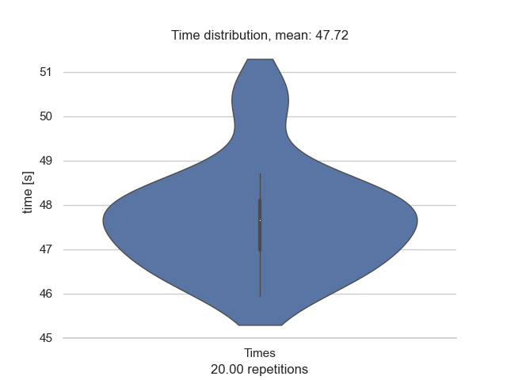
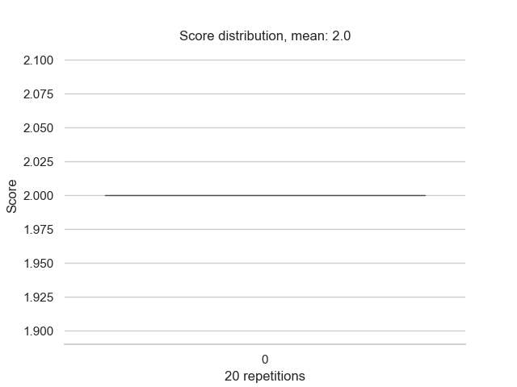

# Repeatability
CT2 was evaluated 20 times using two runs of *autoFOR_MM_CT2_SEQUENCE_Est_Percentage_CT_u8bit_V01p_develop.ijm* macro.

The parameters used:
 * *Start of lungs: 6*
 * *End of lungs: 93*
 * *Lung th:0, 113*
 * *Covid th:35, 118*

The results for time are in subfolder **time_eval**.

The results for score and percentage are in subfolder **time_eval**.

